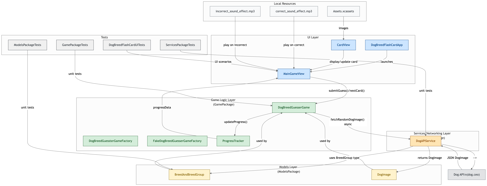

# Dog Breed Flash Card

A SwiftUI iOS app that helps users learn dog breeds through an interactive guessing game.

## Features

- Interactive flash card game with dog breed images
- Sound effects for correct/incorrect answers
- Progress tracking throughout gameplay
- Clean, intuitive user interface

## Dependencies
- This project is based on [Dog API](https://dog.ceo/dog-api/documentation)
- This project also uses [ConfettiSwiftUI](https://github.com/simibac/ConfettiSwiftUI)
- The correct audio effect is from https://www.youtube.com/watch?v=mhgOQmwaic4&list=PPSV
- The incorrect audio effect is from https://www.youtube.com/watch?v=D8CjAH9MXx4&list=PPSV

## Architecture



This project demonstrates modern Swift development practices with **modular Swift Package architecture**:

- **GamePackage**: Core game logic, game factory and progress tracking
    - **ModelsPackage**: Data models for breeds and images  
    - **ServicesPackage**: API service for fetching dog images and breed list

Each package is self-contained with clear dependencies, promoting code reusability and maintainability.

This project also demonstrates the use of swift `async throws` over traditional completion handler for asnychronus operation for better code readibility and clearity on execution order.

#### fetching random dog image using completion handler
```swift
func fetchRandomDogImage(completion: @escaping Result<DogImage, DogAPIServiceError> -> Void)
```

#### fetching random dog image using async throws
```swift
func fetchRandomDogImage() async throws -> DogImage
```

## Testing

The project includes **comprehensive test coverage** across all modules:

- Unit tests for all Swift packages
- UI tests for the main application
- Automated test runner script (`scripts/run_tests.sh`)
- Fake implementations for reliable testing

Run all tests with:
```bash
./scripts/run_tests.sh
./scripts/run_ui_tests.sh
```

## Requirements

- iOS 17.0+
- Xcode 15.0+
- Swift 5.9+